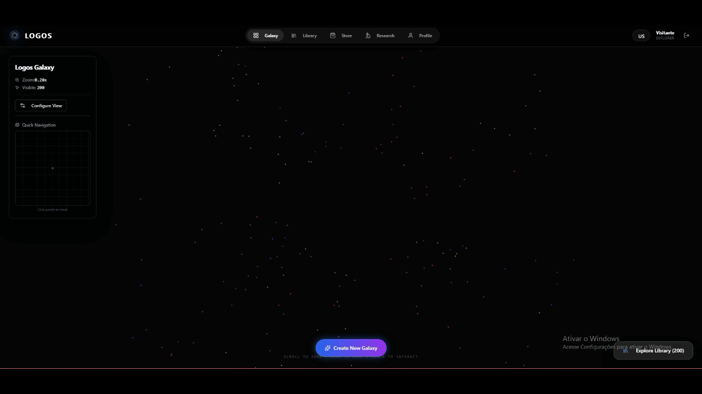

# LOGOS: The Semantic Knowledge Galaxy

**LOGOS** is a cutting-edge **Semantic Knowledge Management Platform** that transforms static documents into a visual, interactive universe of interconnected ideas. Using AI-driven vector embeddings and an event-driven architecture, LOGOS "understands" your data, creating automatic relationships between stars (fragments of knowledge) and galaxies (user-defined study areas).

  

---

## 📺 Video Demonstration

Click the image below to watch the full system walkthrough and see the Galaxy Canvas in action:

---

## 🏗️ Architectural Vision

LOGOS was engineered as a **Multi-Cloud Distributed System** with a focus on high availability, asynchronous processing, and horizontal scalability.

### 📐 System Design (C4 Model)

We use the C4 Model to provide different levels of abstraction for our architecture.

<b>🔍 Level 1: System Context</b> (The Big Picture)

 

  

<i>Provides a high-level view of how users interact with the LOGOS Platform and its external dependencies like Keycloak (GCP), OpenAI, and Google Cloud Storage.</i>

<b>📦 Level 2: Containers</b> (Microservices & Messaging)

 

  

<i>Visualizes the internal container boundaries. This level highlights the <b>Event-Driven communication</b> via Apache Kafka (Confluent Cloud), decoupling our Java and Go services for resilient processing.</i>

<b>⚙️ Level 3: Components</b> (Ingestion Service Deep Dive)

 

  

<i>A granular view of the <b>Ingestion Service (Golang)</b>. This shows the concurrent pipeline designed for high-performance file hashing, zero-allocation cloud streaming, and Kafka event production.</i>

---

## 🚀 Key Technical Pillars

### 🎢 Event-Driven Orchestration (Apache Kafka)
Following European enterprise standards for robust distributed systems, LOGOS utilizes **Kafka (via Confluent Cloud)** as its central nervous system.
*   **Decoupling:** Services never communicate directly; they react to events, ensuring that if the AI Processor is under heavy load, the rest of the system remains responsive.
*   **Reliability:** Uses SASL_SSL for secure cloud-native messaging.
*   **Core Topics:**
    *   `document.ingestion`: Notifies the AI engine to begin processing new data.
    *   `highlight.created`: Triggers the vectorization engine for semantic indexing.
    *   `star.linked`: Propagates newly discovered semantic affinities back to the database.

### ⚡ High-Performance Ingestion (Golang)
The binary ingestion layer was built in **Go** to handle high-concurrency uploads with minimal latency.
*   **Concurrency:** Utilizes Goroutines for non-blocking SHA-256 hash generation and GCS streaming.
*   **Efficiency:** Designed for a low memory footprint, significantly reducing cloud infrastructure costs compared to JVM-based entry points.

### 🧠 AI & Semantic Search
*   **Vector Engine:** Powered by **Pinecone (Serverless)**, storing high-dimensional embeddings generated by OpenAI.
*   **Shooting Star Logic:** A proprietary algorithm where new content "finds" its place in the galaxy by calculating semantic gravity against existing clusters in real-time.

---

## 🛠️ Tech Stack

| Layer | Technologies |
| :--- | :--- |
| **Backend Core** | Java 21, Spring Boot 3.3, Spring Cloud Gateway, LangChain4j |
| **Ingestion** | Go (Golang) 1.22+ |
| **Messaging** | Apache Kafka (Confluent Cloud) |
| **Databases** | PostgreSQL (Neon), Redis (Upstash), Pinecone (Vector DB) |
| **Frontend** | React 18, TypeScript, Vite, D3.js (Physics Engine), React Flow |
| **Cloud & Infra** | AWS EC2 (m7i.large - 8GB RAM), Nginx, Google Cloud Storage |
| **Identity** | Keycloak (OAuth2 / OpenID Connect) |

---

## 🧪 Engineering Challenges & Solutions

### 1. Vector DNS Resolution (The Pinecone "Gotcha")
During production deployment on AWS, Pinecone Serverless indexes used a unique hash-based URL structure. We solved this by implementing dynamic **BaseURL injection** via environment variables, ensuring stable connectivity between the AWS VPC and the Pinecone SaaS host.

### 2. Resource Management in Microservices
Running 4 Spring Boot services + Go inside containers is resource-heavy. We optimized the environment by migrating to **AWS m7i.large (8GB RAM)** instances and implementing **Linux Swap partitioning**, ensuring sub-second response times even during heavy AI indexing.

### 3. Container Security & GCP Auth
To comply with non-root container security policies, we developed a custom `entrypoint.sh` that safely injects Google Service Account JSONs into the `/tmp` directory at runtime, allowing the services to authenticate with GCS without violating security audits.

---

## 🚀 Deployment & CI/CD

The project utilizes a professional **CI/CD Pipeline** via **GitHub Actions**:
1.  **Code Validation:** Automated build checks for Java and Go.
2.  **Secure Transfer:** Encrypted structure transfer to AWS via SCP.
3.  **Docker Orchestration:** Automated `docker-compose` rebuilds with image pruning to maintain server health.

---

## 🌌 Explore the Galaxy

*Developed by Benjamim - Engineering a smarter way to connect knowledge.*